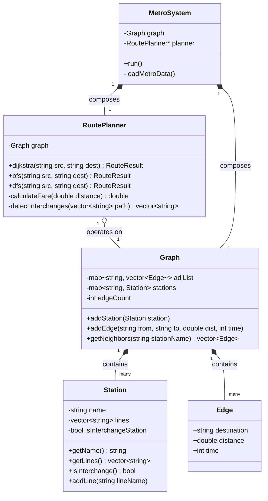

# 🚇 Delhi Metro Navigation System — Complete Technical Report

Welcome to the **Delhi Metro Navigation System** codebase! This report provides a complete, easy-to-understand walkthrough of the project, its underlying graph data structures, pathfinding algorithms, object-oriented software design, testing suite, and execution guide.

---

## 📑 Table of Contents
1. [Executive Summary](#-executive-summary)
2. [Architecture & Class Hierarchy](#-architecture--class-hierarchy)
3. [Core Components & Data Structures](#-core-components--data-structures)
4. [Pathfinding Algorithms Explained](#-pathfinding-algorithms-explained)
5. [Business Logic & Fare Matrix](#-business-logic--fare-matrix)
6. [Object-Oriented Programming (OOP) Design](#-object-oriented-programming-oop-design)
7. [Unit Testing & Verification](#-unit-testing--verification)
8. [Build & Execution Guide](#-build--execution-guide)

---

## 📌 Executive Summary

The **Delhi Metro Navigation System** is a production-grade C++ application that models a real-world urban transit network as a **weighted directed/undirected graph**. It allows passengers to calculate optimal travel routes across 40 metro stations and 5 lines using three distinct routing algorithms.

### Key Capabilities:
- **Shortest Distance Routing**: Finds the path minimizing physical travel distance (km) using **Dijkstra's Algorithm**.
- **Minimum Stops Routing**: Finds the route with the fewest station hops using **Breadth-First Search (BFS)**.
- **Path Exploration**: Traverses paths depth-first using **Depth-First Search (DFS)**.
- **Interchange & Transfer Detection**: Identifies transfer stations (e.g., Kashmere Gate, Rajiv Chowk) where riders change lines.
- **Fare Computation**: Applies official distance-based pricing slabs (₹10 to ₹60).
- **Interactive Command-Line Interface (CLI)**: Provides terminal-based route lookup, graph inspection, and side-by-side algorithm comparison tables.

---

## 🏗️ Architecture & Class Hierarchy

The project follows clean C++ modular development standards with clear separation of declarations (`.h`), algorithm engines, domain models, and test harnesses.



---

## 📂 Project Directory Structure

| Path / File | Type | Description |
| :--- | :--- | :--- |
| [`include/Station.h`](include/Station.h) | Header | Data model representing a station entity (name, connected lines, interchange flag). |
| [`include/Graph.h`](include/Graph.h) | Header | `Edge` struct and `Graph` class representing the metro network using an Adjacency List. |
| [`include/RoutePlanner.h`](include/RoutePlanner.h) | Header | `RouteResult` struct and routing engine implementing Dijkstra, BFS, and DFS. |
| [`include/MetroSystem.h`](include/MetroSystem.h) | Header | Main system controller managing interactive menu workflows and dataset loading. |
| [`tests/test_routes.cpp`](tests/test_routes.cpp) | Test File | 12 automated unit tests using standard `assert()` assertions. |
| [`CMakeLists.txt`](CMakeLists.txt) | Build Config | CMake build specification for C++17 targets. |
| [`README.md`](README.md) | Docs | Concise project overview and usage documentation. |
| `metro_app.exe` | Binary | Executable for interactive terminal menu interface. |
| `test_metro.exe` | Binary | Executable for automated test suite runner. |

---

## 💡 Core Components & Data Structures

### 1. The Graph Representation (`Adjacency List`)
Why **Adjacency List** over Adjacency Matrix?
- A metro map is a **sparse graph**: each station connects to only 2–4 neighboring stations.
- **Space Complexity**: $O(V + E)$ where $V = 40$ (stations) and $E = 41$ (connections).
- Storage mechanism: `std::map<std::string, std::vector<Edge>>` mapping station names to lists of outgoing connections.

### 2. Station Entity (`Station.h`)
- Holds `name` and a `vector<string>` of lines passing through it (e.g., `["Yellow", "Blue"]`).
- Automatically sets `isInterchangeStation = true` whenever a second line is registered via `addLine()`.

### 3. Route Output Model (`RouteResult`)
- Encapsulates path outputs:
  ```cpp
  struct RouteResult {
      vector<string> path;         // Ordered station itinerary
      double totalDistance;        // Total route distance in km
      int totalTime;               // Total estimated travel time in minutes
      int totalStops;              // Number of intermediate stations
      double fare;                 // Calculated ticket price in INR
      vector<string> interchanges; // Transfer stations encountered
      string algorithm;            // Algorithm identifier
      bool found;                  // Execution flag
  };
  ```

---

## 🧠 Pathfinding Algorithms Explained

The core engine provides three distinct routing strategies depending on user priority:

```
                      +-------------------+
                      | Route Request     |
                      | (Source, Dest)    |
                      +---------+---------+
                                |
         +----------------------+----------------------+
         |                      |                      |
         v                      v                      v
+------------------+   +------------------+   +------------------+
|    DIJKSTRA      |   |       BFS        |   |       DFS        |
| Shortest Distance|   |  Minimum Stops   |   | Depth Exploration|
+--------+---------+   +--------+---------+   +--------+---------+
         |                      |                      |
         v                      v                      v
+--------------------------------------------------------------+
|               Unified RouteResult Formatting                 |
|       (Distance, Time, Stops, Fare Slabs, Interchanges)       |
+--------------------------------------------------------------+
```

| Algorithm | Primary Target | Data Structure Used | Time Complexity | Optimality Guarantee |
| :--- | :--- | :--- | :--- | :--- |
| **Dijkstra** | Min Distance (km) | Min-Heap Priority Queue | $O((V + E) \log V)$ | **Optimal Shortest Weighted Path** |
| **BFS** | Fewest Station Hops | FIFO Queue (`std::queue`) | $O(V + E)$ | **Optimal Minimum-Hop Path** |
| **DFS** | Depth Exploration | Stack (`std::stack` / Recursion) | $O(V + E)$ | Valid Path (Sub-optimal) |

> [!TIP]
> **Dijkstra vs BFS Trade-off**:
> - **Dijkstra** guarantees the shortest distance in kilometers, even if it requires taking a route with more intermediate stops.
> - **BFS** guarantees the route with the fewest number of station stops, even if the total physical distance is longer.

---

## 💰 Business Logic & Fare Matrix

Fares are dynamically calculated using the standard Delhi Metro distance slab rules:

| Distance Range (km) | Ticket Price (INR) |
| :--- | :--- |
| $0.0 - 2.0$ km | **₹ 10** |
| $2.0 - 5.0$ km | **₹ 20** |
| $5.0 - 12.0$ km | **₹ 30** |
| $12.0 - 21.0$ km | **₹ 40** |
| $21.0 - 32.0$ km | **₹ 50** |
| $> 32.0$ km | **₹ 60** |

---

## ⚙️ Object-Oriented Programming (OOP) Design

This project serves as an exemplary showcase of modern C++ Object-Oriented Software Design:

1. **Encapsulation**: Internal fields (`adjList`, `stations`, private flags) are kept `private`. Access is provided via clean getter methods (`getName()`, `getNeighbors()`).
2. **Composition**: `MetroSystem` HAS-A `Graph` and HAS-A `RoutePlanner`, cleanly delegating responsibilities instead of utilizing tight inheritance hierarchies.
3. **Single Responsibility Principle (SRP)**:
   - `Station`: Handles individual station metadata and line registrations.
   - `Graph`: Manages network topology and adjacency storage.
   - `RoutePlanner`: Focuses purely on algorithmic traversal logic.
   - `MetroSystem`: Manages terminal input/output and user menus.
4. **Operator Overloading**: `Station::operator==` allows direct comparison between station instances (`stationA == stationB`).

---

## 🧪 Unit Testing & Verification

The project includes an automated test harness in [`tests/test_routes.cpp`](tests/test_routes.cpp) covering **12 test suites**:

1. **Station Creation**: Verifies name assignment and automatic interchange triggering.
2. **Graph Construction**: Verifies node counts, edge counts, and interchange tagging.
3. **Adjacency Integrity**: Ensures neighbors are properly stored bidirectionally.
4. **Dijkstra Correctness**: Proves Dijkstra selects a 10.5 km multi-stop route over a 15.0 km direct connection.
5. **BFS Minimum Stops**: Proves BFS selects a 1-stop 15.0 km route over a multi-stop 10.5 km route.
6. **DFS Exploration**: Verifies path validity between source and destination.
7. **Fare Logic**: Validates correct slab matching for varying distances.
8. **Interchange Detection**: Verifies transfer detection when switching metro lines.
9. **Identity Route**: Tests identical source and destination edge cases.
10. **Error Handling**: Tests invalid/non-existent station queries.
11. **Multi-Line Integration**: Verifies complex routing across lines.
12. **Dijkstra vs BFS Contrast**: Verifies that Dijkstra and BFS optimize different cost functions.

### Running Test Verification:
```bash
.\test_metro.exe
```
**Output Summary**: `12/12 tests passed` (100% success).

---

## 🚀 Build & Execution Guide

### Option 1: Run Compiled Executables Directly (Windows)
```powershell
# Run the Interactive Terminal Application
.\metro_app.exe

# Run Automated Test Suite
.\test_metro.exe
```

### Option 2: Recompile via GCC / G++ Direct Command
```powershell
# Build Main App
g++ -std=c++17 -I include tests/test_routes.cpp -o test_metro.exe

# Build Application
g++ -std=c++17 -I include src/*.cpp -o metro_app.exe
```

### Option 3: Build via CMake
```powershell
mkdir build
cd build
cmake ..
cmake --build .
```

---

## 🎯 Quick Reference for First-Time Readers

If you are examining this project for an interview or code review, focus on these files first:
1. Start with [`include/Graph.h`](include/Graph.h) to see how the graph data structure is built.
2. View [`include/RoutePlanner.h`](include/RoutePlanner.h) to examine the algorithm interface and `RouteResult` output design.
3. Check [`tests/test_routes.cpp`](tests/test_routes.cpp) for tests proving the fundamental difference between Dijkstra (distance optimization) and BFS (stop optimization).
